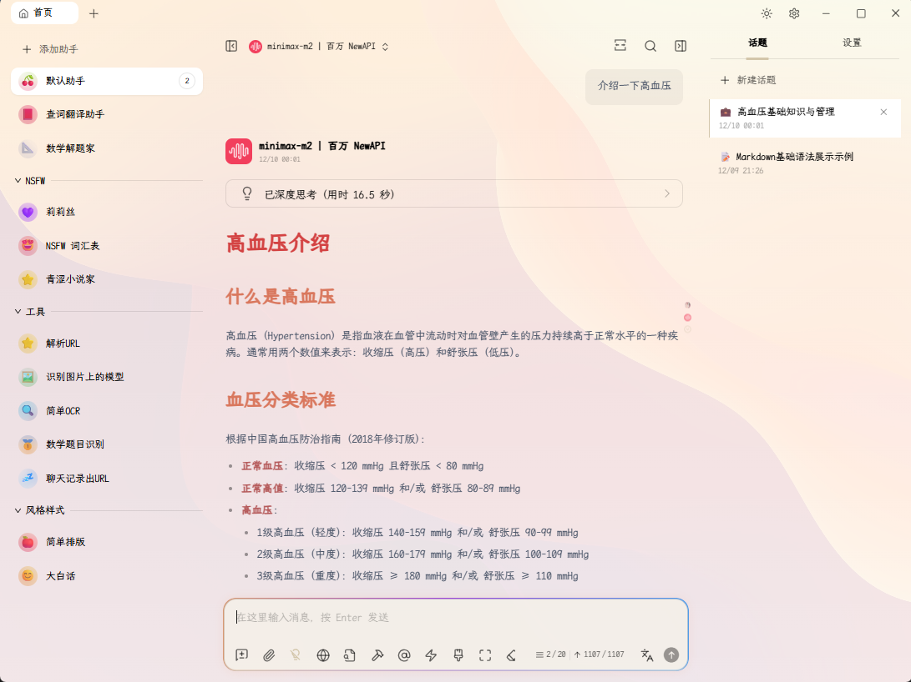
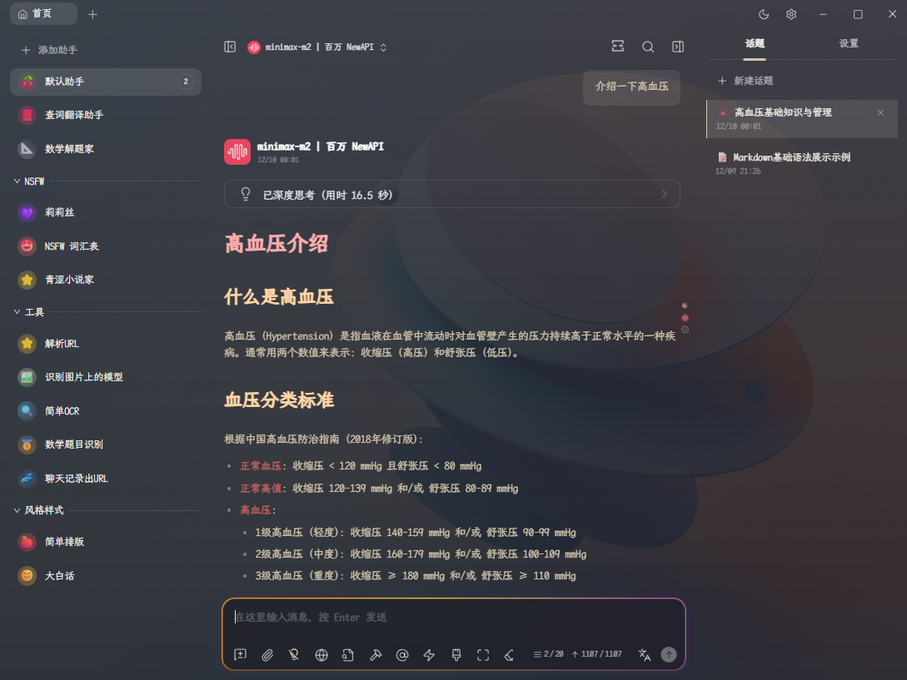
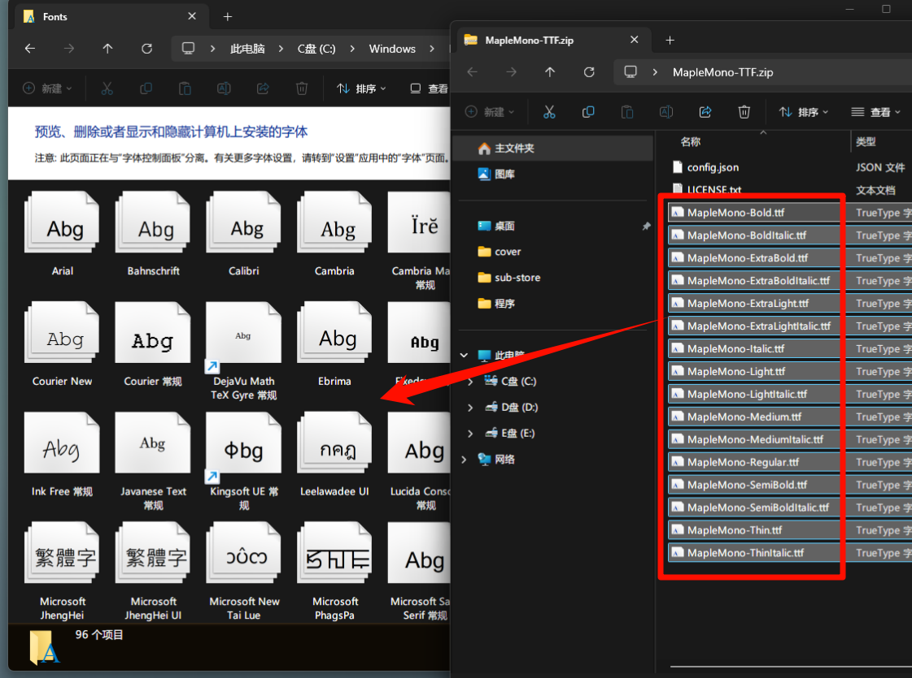
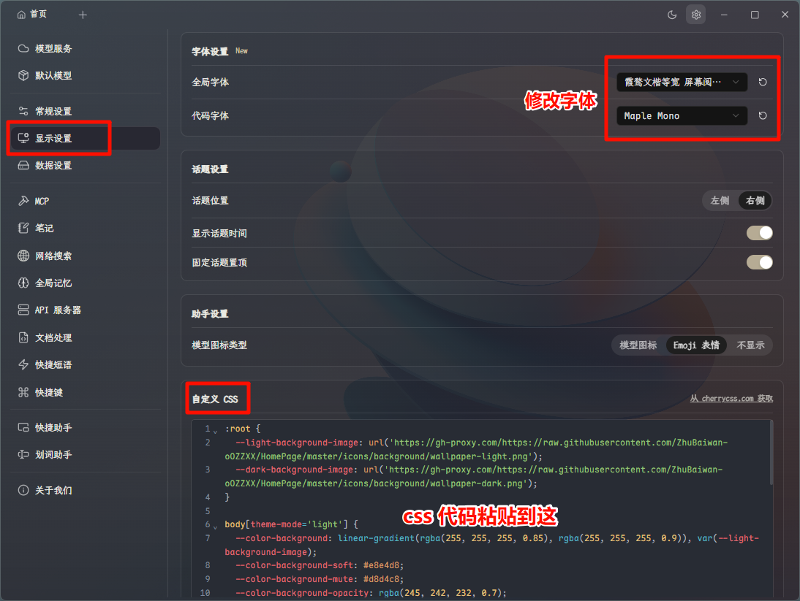

# Cherry Studio 美化

## 一、效果展示

字体选用的 **霞鹜文楷屏幕阅读版等宽** 与 **Maple Mono**，先看看效果:




## 二、下载字体

- Maple Mono：https://font.subf.dev/zh-cn/download （下载文件 .zip，解压后将每个字体文件 .ttf 复制到系统字体目录 `C:\Windows\Fonts`）
- 霞鹜文楷屏幕阅读版：https://github.com/lxgw/LxgwWenKai-Screen/releases （这选一个就行，我选的 LXGWWenKaiMonoScreen.ttf）



## 三、Cherry Studio 美化

Cherry Studio 显示设置里选择字体，如果没有显示字体，就重启 Cherry Studio/电脑。


最下面的`自定义 CSS`里粘贴以下 CSS 片段：

> 背景图片体积较大，第一次加载会比较慢。

```CSS
:root {
  --light-background-image: url('https://gh-proxy.com/https://raw.githubusercontent.com/ZhuBaiwan-oOZZXX/HomePage/master/icons/background/wallpaper-light.png');
  --dark-background-image: url('https://gh-proxy.com/https://raw.githubusercontent.com/ZhuBaiwan-oOZZXX/HomePage/master/icons/background/wallpaper-dark.png');
}

body[theme-mode='light'] {
  --color-background: linear-gradient(rgba(255, 255, 255, 0.85), rgba(255, 255, 255, 0.9)), var(--light-background-image);
  --color-background-soft: #e8e4d8;
  --color-background-mute: #d8d4c8;
  --color-background-opacity: rgba(245, 242, 232, 0.7);
  --navbar-background-mac: transparent;
  --navbar-background: transparent;

  background-image: var(--color-background);
  background-size: cover;
  background-repeat: no-repeat;
  background-attachment: fixed;
}

body[theme-mode='dark'] {
  --color-background: linear-gradient(rgba(20, 20, 30, 0.75), rgba(20, 20, 30, 0.85)), var(--dark-background-image);
  --color-background-soft: #282832;
  --color-background-mute: #32323c;
  --color-background-opacity: rgba(30, 30, 40, 0.7);
  --navbar-background-mac: transparent;
  --navbar-background: transparent;

  background-image: var(--color-background);
  background-size: cover;
  background-repeat: no-repeat;
  background-attachment: fixed;
}


/* 代码块透明背景 */
div.shiki,
.markdown pre {
  background-color: rgba(0,0,0,0) !important;
}

div[class^="CodeHeader-"] {
  background-color: rgba(0,0,0,0);
}


/* Maple Neon Minimal Theme for Cherry Studio
   专注于输入框AI智能体运行时的跑马灯效果 */

/* === AI智能体跑马灯动画 === */
@keyframes ai-running-gradient {
    0% {
        background-position: 0% 50%;
    }
    25% {
        background-position: 100% 50%;
    }
    50% {
        background-position: 200% 50%;
    }
    75% {
        background-position: 300% 50%;
    }
    100% {
        background-position: 400% 50%;
    }
}

/* AI思考状态脉冲 */
@keyframes ai-thinking-pulse {
    0%,
    100% {
        box-shadow: 0 0 5px rgba(255, 106, 1, 0.2);
    }
    50% {
        box-shadow: 0 0 20px rgba(138, 43, 226, 0.6);
    }
}

/* 数据流动效果 */
@keyframes ai-data-flow {
    0% {
        transform: translateX(-100%);
        opacity: 0;
    }
    50% {
        opacity: 1;
    }
    100% {
        transform: translateX(100%);
        opacity: 0;
    }
}

/* === 输入框跑马灯效果 === */
#inputbar {
    position: relative;
    border-radius: 12px;
}

/* AI运行时的跑马灯边框 */
#inputbar::before {
    content: "";
    position: absolute;
    inset: -2px;
    border-radius: inherit;
    padding: 2px;
    background: linear-gradient(
        90deg,
        #ff6a01,
        /* 爱马仕橙 */ #f8c91c,
        /* 那不勒斯黄 */ #8a2be2,
        /* 紫罗兰 */ #00d4ff,
        /* 青色 */ #f8c91c,
        /* 那不勒斯黄 */ #ff6a01 /* 爱马仕橙 */
    );
    background-size: 300% 100%;
    mask:
        linear-gradient(#fff 0 0) content-box,
        linear-gradient(#fff 0 0);
    -webkit-mask:
        linear-gradient(#fff 0 0) content-box,
        linear-gradient(#fff 0 0);
    -webkit-mask-composite: destination-out;
    mask-composite: exclude;
    animation: ai-running-gradient 7s linear infinite;
    opacity: 0;
    transition: opacity 0.4s ease-in-out;
    pointer-events: none;
    z-index: -1;
}

/* 激活跑马灯效果的条件 */
#inputbar:focus-within::before,
#inputbar.ai-active::before,
#inputbar[data-ai-status="running"]::before {
    opacity: 1;
}

/* AI思考状态的额外效果 */
#inputbar.ai-thinking {
    animation: ai-thinking-pulse 4s ease-in-out infinite;
}

/* 数据流动覆盖层 */
#inputbar.ai-thinking::after {
    content: "";
    position: absolute;
    top: 0;
    left: -100%;
    width: 100%;
    height: 100%;
    background: linear-gradient(
        90deg,
        transparent,
        rgba(0, 212, 255, 0.1),
        transparent
    );
    animation: ai-data-flow 3.5s ease-in-out infinite;
    border-radius: inherit;
    pointer-events: none;
    z-index: 1;
}

/* === 输入框内部样式优化 === */
#inputbar input,
#inputbar textarea {
    position: relative;
    z-index: 2;
    transition: all 0.3s ease;
}

/* === 状态指示器 === */
.ai-status-dot {
    position: absolute;
    top: 8px;
    right: 8px;
    width: 6px;
    height: 6px;
    border-radius: 50%;
    background: #8a2be2;
    opacity: 0;
    transition: opacity 0.3s ease;
    z-index: 3;
}

#inputbar.ai-thinking .ai-status-dot,
#inputbar[data-ai-status="running"] .ai-status-dot {
    opacity: 1;
    animation: ai-thinking-pulse 3s ease-in-out infinite;
}

/* === 辅助类 === */
/* 手动触发AI运行效果 */
.ai-mode-active #inputbar::before {
    opacity: 1 !important;
}

/* 禁用AI效果 */
.ai-mode-disabled #inputbar::before,
.ai-mode-disabled #inputbar::after {
    opacity: 0 !important;
    animation: none !important;
}

/* === 响应式设计 === */
@media (max-width: 768px) {
    #inputbar::before {
        inset: -1px;
        padding: 1px;
    }

    #inputbar::before {
        background-size: 200% 100%;
        animation-duration: 5.5s;
    }
}

/* === 无障碍支持 === */
@media (prefers-reduced-motion: reduce) {
    #inputbar::before,
    #inputbar::after,
    #inputbar,
    .ai-status-dot {
        animation: none !important;
    }

    #inputbar::before {
        background: linear-gradient(90deg, #ff6a01, #8a2be2);
        background-size: 100% 100%;
    }
}

/* === 高对比度模式 === */
@media (prefers-contrast: high) {
    #inputbar::before {
        background: linear-gradient(
            90deg,
            #ff8c00,
            #ffd700,
            #9370db,
            #00bfff,
            #ffd700,
            #ff8c00
        );
    }
}

/* === 浏览器兼容性修复 === */
/* Firefox支持 */
@supports not (-webkit-mask-composite: destination-out) {
    #inputbar::before {
        mask-composite: exclude;
    }
}

/* Safari支持 */
@supports (-webkit-mask-composite: destination-out) {
    #inputbar::before {
        -webkit-mask-composite: destination-out;
    }
}


/* Markdown 内容样式 */
/* Light模式样式 */
body[theme-mode="light"] .markdown { color: #4A5568; }
body[theme-mode="light"] .markdown h1 { font-size: 2em; color: #D34242; border: none; padding-bottom: 0; font-weight: 600; }
body[theme-mode="light"] .markdown h2 { font-size: 1.75em; color: #D9775D; border: none; padding-bottom: 0; font-weight: 600; }
body[theme-mode="light"] .markdown h3 { font-size: 1.5em; color: #C6894D; border: none; padding-bottom: 0; font-weight: 600; }
body[theme-mode="light"] .markdown h4 { font-size: 1.25em; color: #5A8F5A; border: none; padding-bottom: 0; font-weight: 600; }
body[theme-mode="light"] .markdown h5 { font-size: 1.1em; color: #5C8CBF; border: none; padding-bottom: 0; font-weight: 600; }
body[theme-mode="light"] .markdown h6 { font-size: 1em; color: #7A6BA8; border: none; padding-bottom: 0; font-weight: 600; }
body[theme-mode="light"] .markdown strong { color: #B55A5A; font-weight: bold; }
body[theme-mode="light"] .markdown em { color: #829181; font-style: italic; }
body[theme-mode="light"] .markdown hr { border: none; height: 1px; background: linear-gradient(90deg, transparent, #E5FFFF, transparent); }
body[theme-mode="light"] .markdown a { color: #3795C5; text-decoration: none; border-bottom: 1px solid rgba(141,161,1,0.2); }
body[theme-mode="light"] .markdown blockquote { margin: 0; background-color: rgba(239, 235, 212, 0.4); border-left: 4px solid #bec5b2; border-radius: 8px; }

/* Dark模式样式 */
body[theme-mode="dark"] .markdown { color: #d3c6aa; }
body[theme-mode="dark"] .markdown h1 { font-size: 2em; color: #FFADAD; border: none; padding-bottom: 0; font-weight: 600; }
body[theme-mode="dark"] .markdown h2 { font-size: 1.75em; color: #FFD6A5; border: none; padding-bottom: 0; font-weight: 600; }
body[theme-mode="dark"] .markdown h3 { font-size: 1.5em; color: #FDFFB6; border: none; padding-bottom: 0; font-weight: 600; }
body[theme-mode="dark"] .markdown h4 { font-size: 1.25em; color: #CAFFBF; border: none; padding-bottom: 0; font-weight: 600; }
body[theme-mode="dark"] .markdown h5 { font-size: 1.1em; color: #9BF6FF; border: none; padding-bottom: 0; font-weight: 600; }
body[theme-mode="dark"] .markdown h6 { font-size: 1em; color: #A0C4FF; border: none; padding-bottom: 0; font-weight: 600; }
body[theme-mode="dark"] .markdown strong { color: #B55A5A; font-weight: bold; }
body[theme-mode="dark"] .markdown em { color: #9da9a0; font-style: italic; }
body[theme-mode="dark"] .markdown hr { border: none; height: 1px; background: linear-gradient(90deg, transparent, #E5FFFF, transparent); }
body[theme-mode="dark"] .markdown a { color: #7fbbb3; text-decoration: none; border-bottom: 1px solid rgba(167,192,128,0.2); }
body[theme-mode="dark"] .markdown blockquote { margin: 0; background-color: rgba(40, 48, 53, 0.4); border-left: 4px solid #4f585e; border-radius: 8px; }

/* 脚注样式 */
.footnotes { margin: 1em 0; padding: 8px 12px; border-radius: 8px; background-color: transparent; }
```
