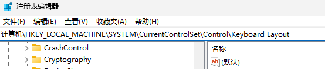
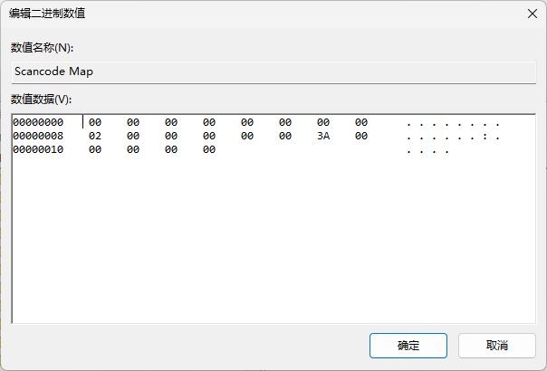

# Windows 上禁用 CapsLock 键

> 经验证此方法有效：https://blog.csdn.net/NicholasPeter/article/details/141597656
>
> 在此搬运，防止未来丢失

## 操作步骤

### Step 1: 打开注册表编辑器

首先，按下 Win + R，输入 regedit，并回车进入注册表编辑器。

### Step 2: 导航到键盘布局设置

在注册表编辑器中，依次导航到以下路径：

```bash
HKEY_LOCAL_MACHINE\SYSTEM\CurrentControlSet\Control\Keyboard Layout
```



### Step 3: 创建 Scancode Map 键值

在右侧空白区域，右键选择 新建 > 二进制值，将其命名为 Scancode Map。然后，双击这个新建的键值，在弹出的编辑框中输入以下数据：

```plaintext
00 00 00 00 00 00 00 00
02 00 00 00 00 00 3A 00
00 00 00 00
```

功能：禁用 Caps Lock 键
效果：按下 Caps Lock 键时，系统不会识别任何按键操作



### Step 4: 重启系统

保存更改后，关闭注册表编辑器并重启电脑，Caps Lock 键就被成功禁用了。

## 原理解释

上述中 Scancode Map 的键值为

```plaintext
00 00 00 00 00 00 00 00
02 00 00 00 00 00 3A 00
00 00 00 00
```

意思是：将 Caps Lock 键映射到空键，即禁用 Caps Lock 键。

```plaintext
00 00 00 00 00 00 00 00  ; 固定头部
02 00 00 00              ; 映射数量：1个映射
00 00                    ; 目标键：空键 (扫描码0x00)
3A 00                    ; 源键：Caps Lock键 (扫描码0x3A)
00 00 00 00              ; 结束标记
```

你也可以把 Caps Lock 键映射到其他键，比如下面这样：

```plaintext
00 00 00 00 00 00 00 00
02 00 00 00 01 00 3A 00
00 00 00 00
```

意思是：将 Caps Lock 键映射到 Esc 键，即按下 Caps Lock 键时，系统会识别为 Esc 键的操作。

```plaintext
00 00 00 00 00 00 00 00  ; 固定头部
02 00 00 00              ; 映射数量：1个映射
01 00                    ; 目标键：Esc键 (扫描码0x01)
3A 00                    ; 源键：Caps Lock键 (扫描码0x3A)
00 00 00 00              ; 结束标记
```
