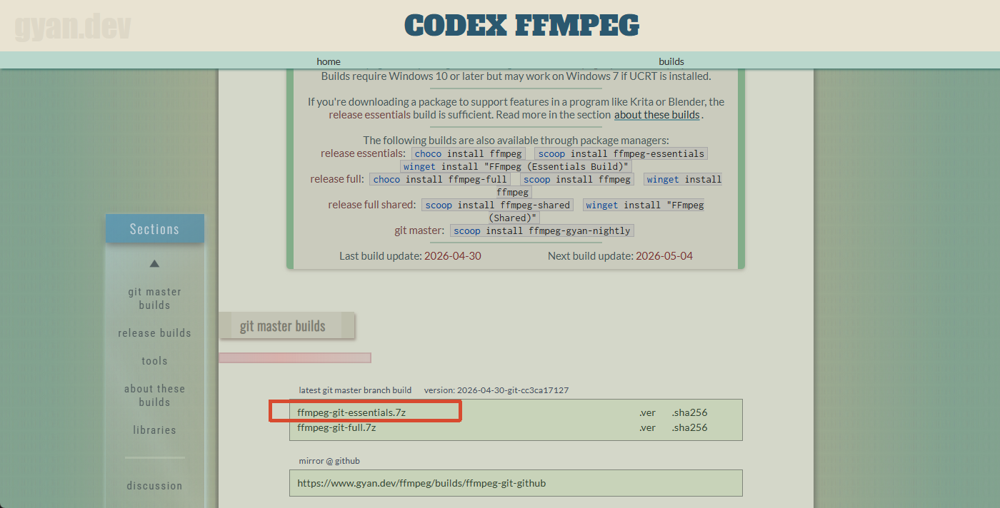

# yt-dlp 下载B站视频

## 环境准备

1. 下载 yt-dlp.exe：https://github.com/yt-dlp/yt-dlp/releases
2. 下载 ffmpeg：https://www.gyan.dev/ffmpeg/builds/



3. 解压 ffmpeg 到任意位置，将 `bin` 目录添加到系统环境变量的 PATH 中，例如添加：`D:\ffmpeg-8.0.1-essentials_build\bin`

## 下载视频

使用以下命令下载 B站 视频：

```bash
.\yt-dlp.exe -f "bestvideo+bestaudio/best" --merge-output-format mp4 -o "%(title)s.%(ext)s" https://www.bilibili.com/video/BV1AoUVBaEiv/
```

**参数说明：**

| 参数                            | 说明                   |
| ------------------------------- | ---------------------- |
| `-f "bestvideo+bestaudio/best"` | 选择最佳视频和最佳音频 |
| `--merge-output-format mp4`     | 合并后输出为 MP4 格式  |
| `-o "%(title)s.%(ext)s"`        | 以视频标题作为文件名   |

## 添加 Cookie 参数

添加 Cookie 参数有以下作用：

- 避免被识别为恶意流量或机器人
- **可以下载更高质量的视频**
- 下载 YouTube 视频时，节点太脏被禁止访问，可通过 Cookie 避免

### 获取 Cookie 的方法

1. 安装 Chrome 插件：[Get cookies.txt LOCALLY](https://chromewebstore.google.com/detail/get-cookiestxt-locally/cclelndahbckbenkjhflpdbgdldlbecc)
2. 打开目标网站（如 YouTube），点击插件图标
3. 点击 `Export` 导出 Cookie 文件，重命名为 `cookies.txt`

### 使用 Cookie 下载

```bash
.\yt-dlp.exe -f "bestvideo+bestaudio/best" --merge-output-format mp4 -o "%(title)s.%(ext)s" --cookies cookies.txt https://www.bilibili.com/video/BV1AoUVBaEiv/
```

**注意：** `cookies.txt` 需与 `yt-dlp.exe` 放在同一目录下
