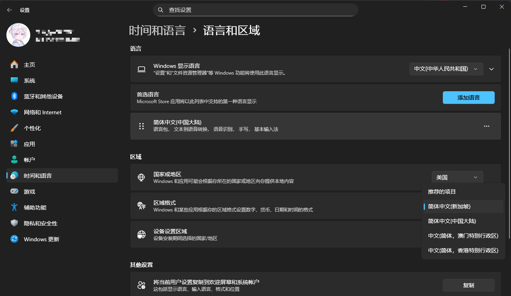

# 修复 Windows 数字显示成符号的异常

我的 Windows 电脑数字显示异常，出现了 `16 项 〉〈.(( MB`、`<,》> 》位成员`、`〈⎦() 位成员` 这样的状况

只需要修改 `语言和区域` 中的 `区域格式` 即可修复。

`win + i` 打开设置，点击 `时间和语言` -> `语言和区域`，我的 `区域格式` 是 `中文(简体，香港特别行政区)` 才有这样的问题，换一个就好啦~

