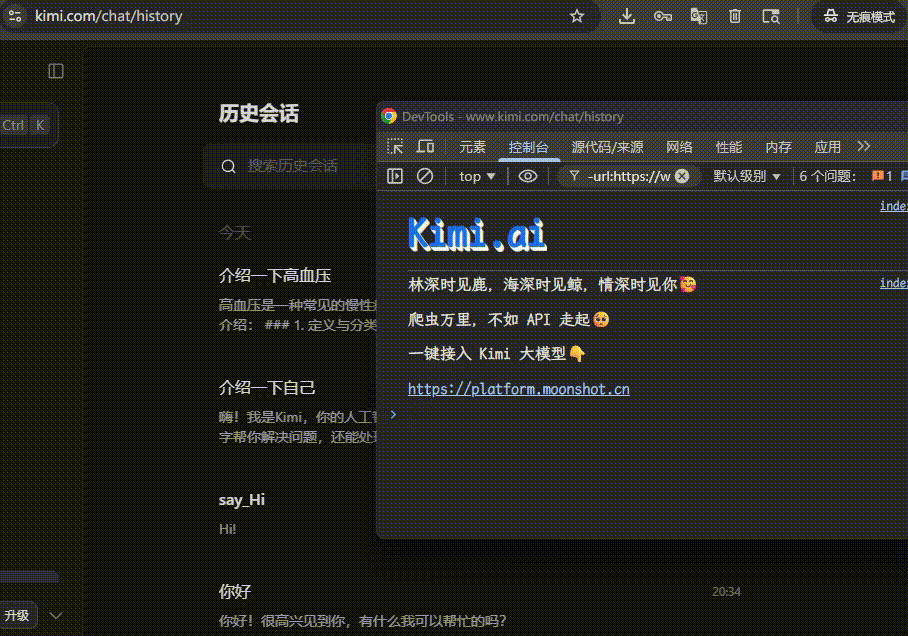

# 批量删除 kimi 网页对话

今天打开 kimi 发现有一堆历史垃圾对话，但 Kimi 网页上一直也没有批量删除的功能，只能一个一个选中删除。

要解决这件事也很简单，找到所有的复选框，点击一下就好了。

F12 打开控制台，输入以下代码：

```js
document.querySelectorAll("input[type=checkbox]:not(:checked)").forEach((c) => c.click());
```

效果如下：


