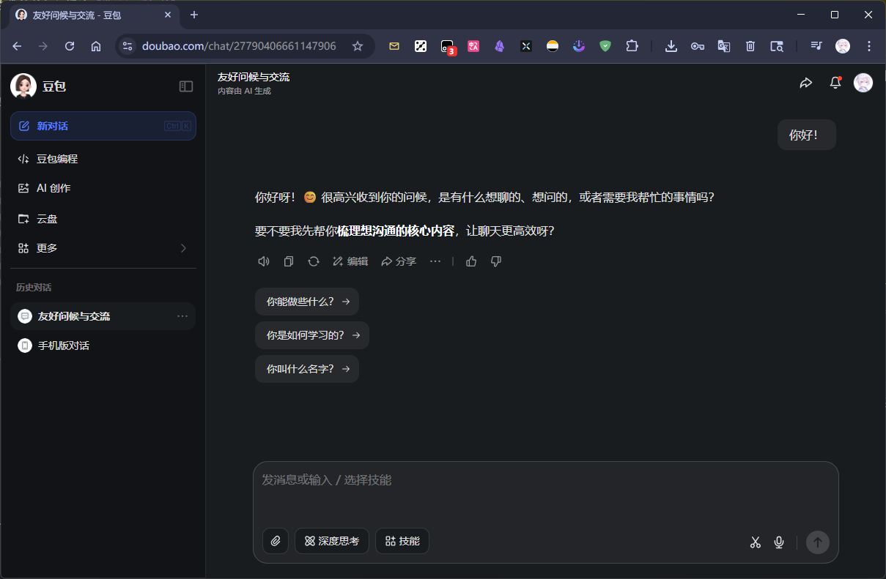

# 豆包网页开启黑暗主题

豆包网页有黑暗主题，但是页面上没有直接开启的方法，使用此油猴脚本强制开启黑暗主题。

```js
// ==UserScript==
// @name         豆包网页版黑暗主题
// @description  豆包网页版全局强制黑暗主题
// @version      1.0
// @author       doubao
// @match        https://*.doubao.com/*
// @grant        none
// @run-at       document-start
// ==/UserScript==

(() => {
  const raw = Element.prototype.setAttribute;
  Element.prototype.setAttribute = function (key, val) {
    if (this === document.documentElement && key === "data-theme") {
      val = "dark";
      console.log("【油猴】[Doubao-Dark] 强制锁定 data-theme = dark");
    }
    return raw.call(this, key, val);
  };
})();
```


