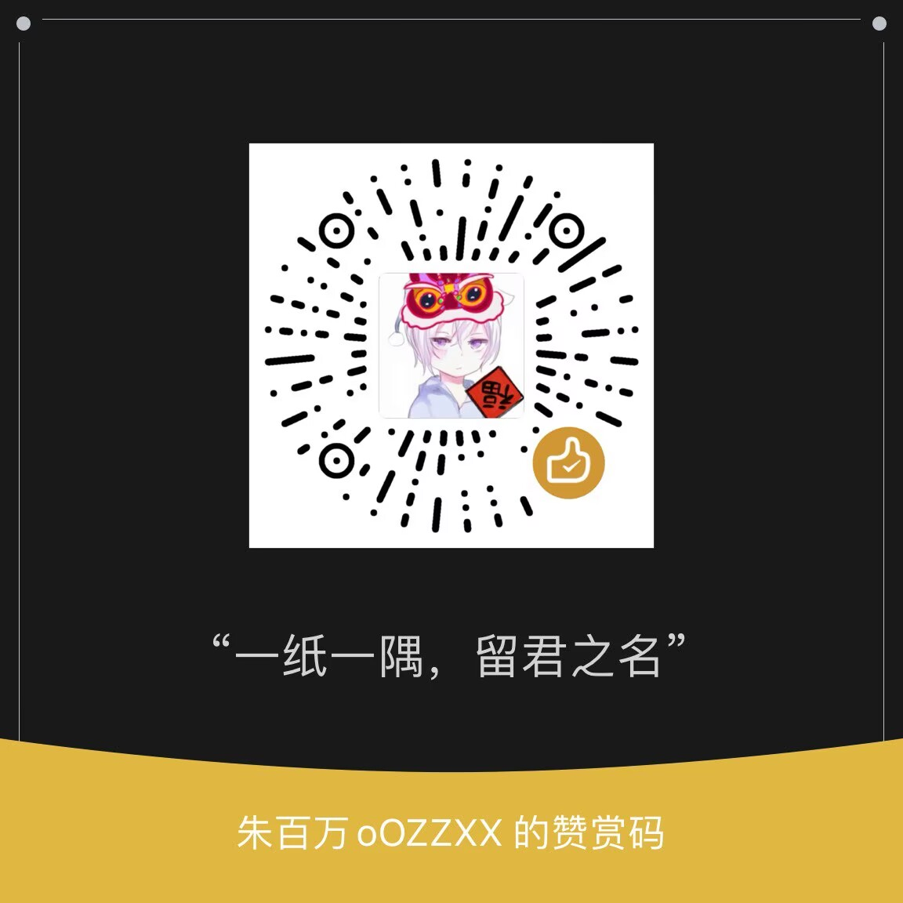

# 百万的 API KEY

> **本站持续完全免费 14 个月，且永不支持注册与购买！**
>
> - 个人用不完，如果是薅羊毛请找个大羊毛，不要来捡这一点点肉！
> - 报错、截断可以重试，失败多换模型并通知群主
> - 允许涩涩，但带 safe 的模型、gpt 系列的模型禁止涩涩！

## 一、API 地址与模型列表

- **API 接入地址**：https://api.zhubaiwan.xyz
  - 如无法使用，尝试在地址后添加 /v1，即 https://api.zhubaiwan.xyz/v1
- **模型列表**：https://models.baiwan.de
- **API 密钥**：因被滥用，现改为私信申请制（不是注册）！
  - 曾经申请过密钥但失效的，可以用旧密钥自动领取新的：https://bw-key.deno.dev (打不开请使用流量)

## 二、API 申请模板

填写模板，请修改 `[]` 中为你需要的内容，私信发给我的 QQ / 小红书 / 微信，我会发送给你 API Key。

```plaintext
QQ/小红书/微信号：[任选一个，真实的账号ID]（必填）
API 用途：[Cherry Studio/酒馆/rikkahub/kelivo/...]（必填）
每日用量：[20-50]条（必填）
常用模型：[deepseek/deepseek-v4-pro、glm/glm-5 等]（必填）

我会保证密钥绝不分享、外泄，遵守使用规定，反馈模型问题，希望群主大大通过，感谢！
```

## 三、模型限制

- 🚫禁止任何形式的滥用与分发，**请勿推荐给任何人**
- 🚫禁止**轮询测试**、**并发请求**！如沉浸式翻译、大量发送 "hi"
- 🚫禁止 NSFW 的模型：带 safe 的模型、gpt 系列
- 🚫禁止短时间多次超长文本输入，例如 80k、90k 和 100k
- 🚫禁止在**龙虾**、**长 Agent 任务**等大量消耗 token 的场景使用
- 发现**违规就停用密钥**
- 对话命名推荐使用小模型代替，例如：`glm/glm-4-flash`、`LongCat-Flash-Lite`
- 非官方，大多来自逆向或其他人提供的 API，不支持工具调用 (`tools`) 或 `temperature`、`top_p` 等参数
- 如需大量使用，本公益 API 不太适合您，还请手下留情

## 四、推荐客户端 ([QQ 群](https://qm.qq.com/q/2nPuWaigM4) 有安装包)

1. Windows/Mac：Cherry Studio
   - 官网地址：https://www.cherry-ai.com/download
   - GitHub 地址：https://github.com/CherryHQ/cherry-studio/releases
2. 安卓：rikkahub
   - 官网地址：https://rikka-ai.com
   - GitHub 地址：https://github.com/rikkahub/rikkahub/releases
3. iOS：Kelivo
   - 官网地址：https://kelivo.psycheas.top/zh/
   - GitHub 地址：https://github.com/Chevey339/kelivo

## 五、微信打赏

备注账号 (推荐QQ) 领取其他福利


